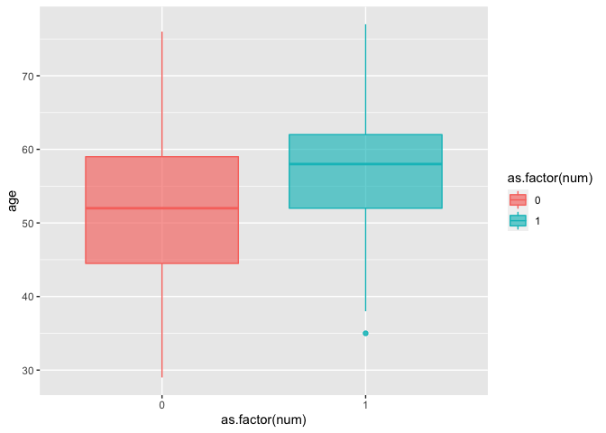
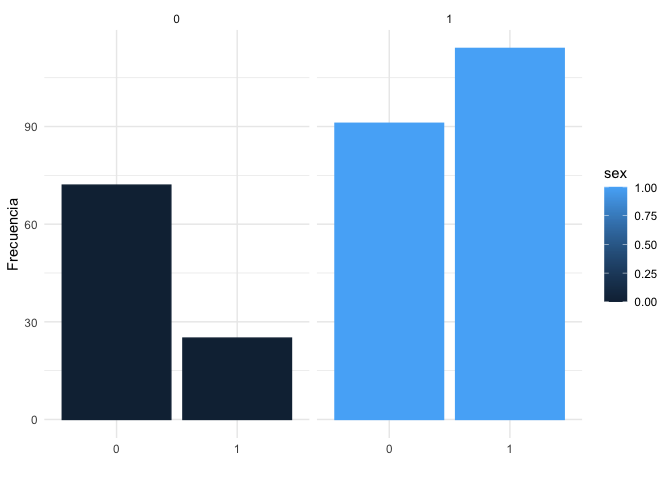
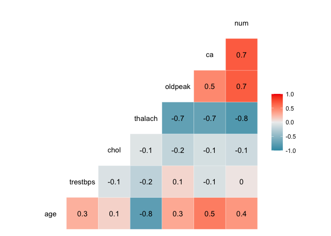
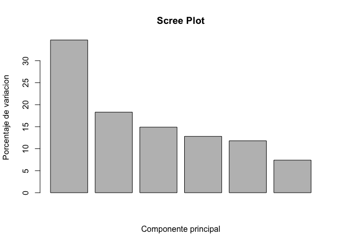
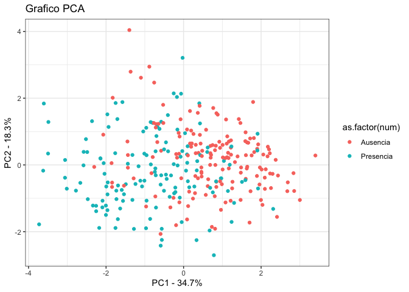

******
# Introducción
******
## Presentación
Esta práctica cubre de forma transversal la asignatura.

Las Prácticas 1 y 2 de la asignatura se plantean de una forma conjunta de modo que la Práctica 2 será continuación de la 1.

El objetivo global de las dos prácticas consiste en seleccionar uno o varios juegos de datos, realizar las tareas de **preparación y análisis exploratorio** con el objetivo de disponer de datos listos para **aplicar algoritmos** de clustering, asociación y clasificación.

## Competencias
Las competencias que se trabajan en esta prueba son:  

* Uso y aplicación de las TIC en el ámbito académico y profesional.
* Capacidad para innovar y generar nuevas ideas.
* Capacidad para evaluar soluciones tecnológicas y elaborar propuestas de proyectos teniendo en cuenta los recursos, las alternativas disponibles y las condiciones de mercado.
* Conocer las tecnologías de comunicaciones actuales y emergentes así como saberlas aplicar convenientemente para diseñar y desarrollar soluciones basadas en sistemas y tecnologías de la información.
* Aplicación de las técnicas específicas de ingeniería del software en las diferentes etapas del ciclo de vida de un proyecto.
* Capacidad para aplicar las técnicas específicas de tratamiento, almacenamiento y administración de datos.
* Capacidad para proponer y evaluar diferentes alternativas tecnológicas para resolver un problema concreto.

## Objetivos
La correcta asimilación de todos los aspectos trabajados durante el semestre.  
En esta práctica abordamos un caso real de minería de datos donde tenemos que poner en juego todos los conceptos trabajados.
Hay que trabajar todo el ciclo de vida del proyecto. Desde el objetivo del proyecto hasta la implementación del conocimiento encontrado pasando por la preparación, limpieza de los datos, conocimiento de los datos, generación del modelo, interpretación y evaluación.

## Descripción de la PRA a realizar

## Recursos Básicos
Material docente proporcionado por la UOC. 

## Criterios de valoración

**Ejercicios prácticos** 

Para todas las PRA es **necesario documentar** en cada apartado del ejercicio práctico que se ha hecho y como se ha hecho.

## Formato y fecha de entrega PRA_1
El formato de entrega es: usernameestudiant-PRAn.html/doc/docx/odt/pdf  
Fecha de entrega: 02/12/2020  
Se debe entregar la PRA_1 en el buzón de entregas del aula  

## Nota: Propiedad intelectual 

> A menudo es inevitable, al producir una obra multimedia, hacer uso de recursos creados por terceras personas. Es por lo tanto comprensible hacerlo en el marco de una práctica de los estudios de Informática, Multimedia y Telecomunicación de la UOC, siempre y cuando esto se documente claramente y no suponga plagio en la práctica. 

> Por lo tanto, al presentar una práctica que haga uso de recursos ajenos, se debe presentar junto con ella un documento en que se detallen todos ellos, especificando el nombre de cada recurso, su autor, el lugar donde se obtuvo y su estatus legal: si la obra esta protegida por el copyright o se acoge a alguna otra licencia de uso (Creative Commons, licencia GNU, GPL ...). 
El estudiante deberá asegurarse de que la licencia no impide específicamente su uso en el marco de la práctica. En caso de no encontrar la información correspondiente tendrá que asumir que la obra esta protegida por copyright. 

> Deberéis, además, adjuntar los ficheros originales cuando las obras utilizadas sean digitales, y su código fuente si corresponde.  

******
# Enunciado
******
Todo estudio analítico debe nacer de una necesidad por parte del **negocio** o de una voluntad de dotarle de un conocimiento contenido en los datos y que solo podremos obtener a través de una colección de buenas prácticas basadas en la Minería de Datos.  

El mundo de la analítica de datos se sustenta en 3 ejes:  

1. Uno de ellos es el profundo **conocimiento** que deberíamos tener **del negocio** al que tratamos de dar respuestas mediante los estudios analíticos.  

2. El otro gran eje es sin duda las **capacidades analíticas** que seamos capaces de desplegar y en este sentido, las dos prácticas de esta asignatura pretenden que el estudiante realice un recorrido sólido por este segundo eje.  

3. El tercer eje son los **Datos**. Las necesidades del Negocio deben concretarse con preguntas analíticas que a su vez sean viables responder a partir de los datos de que disponemos. La tarea de analizar los datos es sin duda importante, pero la tarea de identificarlos y obtenerlos va a ser para un analista un reto permanente.  

Como **primera parte** del estudio analítico que nos disponemos a realizar, se pide al estudiante que complete los siguientes pasos:   

1. Seleccionar un juego de datos y justificar su elección. El juego de datos deberá tener capacidades para que se le puedan aplicar algoritmos supervisados, algoritmos no supervisados y reglas de asociación.   

2. Realizar un análisis exploratorio del juego de datos seleccionado.   

3. Realizar tareas de limpieza y acondicionado para poder ser usado en procesos de modelado.

4. Realizar métodos de discretización

5. Aplicar un estudio PCA sobre el juego de datos. A pesar de no estar explicado en el material didáctico, se valorará si en lugar de PCA investigáis por vuestra cuenta y aplicáis SVD (Single Value Decomposition).


******
# Rúbrica
******
* 25%. Justificación de la elección del juego de datos donde se detalle el potencial analítico que se intuye. El estudiante deberá visitar los siguientes portales de datos abiertos para seleccionar su juego de datos:
  + [Datos.gob.es](https://datos.gob.es/es/catalogo?q=&frequency=%7B"type"%3A+"months"%2C+"value"%3A+"1"%7D&sort=score+desc%2C+metadata_modified+desc)
  + [UCI Machine Learning](https://archive.ics.uci.edu/ml/datasets.php)
  + [Datasets Wikipedia](https://en.wikipedia.org/wiki/List_of_datasets_for_machine-learning_research)
  + [Datos abiertos Madrid](https://datos.madrid.es/portal/site/egob/)
  + [Datos abiertos Barcelona](https://opendata-ajuntament.barcelona.cat/es/)
  + [London Datastore](https://data.london.gov.uk/)
  + [NYC OpenData](https://opendata.cityofnewyork.us/)
* 25%. Información extraída del análisis exploratorio. Distribuciones, correlaciones, anomalías,... 
* 25%. Explicación clara de cualquier tarea de limpieza o acondicionado que se realiza. Justificando el motivo y mencionando las ventajas de la acción tomada.
* 25%. Se realiza un proceso de PCA o SVD donde se aprecia mediante explicaciones y comentarios que el estudiante entiende todos los pasos y se Scomenta extensamente el resultado final obtenido.


******
# Recursos de programación
******
* Incluimos en este apartado una lista de recursos de programación para minería de datos donde podréis encontrar ejemplos, ideas e inspiración:
  + [Material adicional del libro: Minería de datos Modelos y Algoritmos](http://oer.uoc.edu/libroMD/)
  + [Espacio de recursos UOC para ciencia de datos](http://datascience.recursos.uoc.edu/es/)
  + [Buscador de código R](https://rseek.org/)  
  + [Colección de cheatsheets en R](https://rstudio.com/resources/cheatsheets/)  
  

******

******

Se seleciono el juego de datos asociado a enfermedades cardiacas disponible en https://archive.ics.uci.edu/ml/datasets/Heart+Disease Este dataset en particular es interesante ya que al contener multiple variables que buscan predecir el potencial de tener una enfermedad cardiaca podriamos beneficiarnos de reducir esas dimensiones a traves de un PCA para lograr el mismo poder predicitvo con menor informacion en el futuro.

El conjunto de datos Utilizado cuenta con las siguientes variables:
1. (age) age: age in years
2. (sex) sex (1 = male; 0 = female)
3. (cp) chest pain type
-- Value 1: typical angina
-- Value 2: atypical angina
-- Value 3: non-anginal pain
-- Value 4: asymptomatic
4. (trestbps) resting blood pressure (in mm Hg on admission to the hospital)
5. (chol) serum cholestoral in mg/dl
6. (fbs) (fasting blood sugar > 120 mg/dl) (1 = true; 0 = false)
7. (restecg) resting electrocardiographic results
-- Value 0: normal
-- Value 1: having ST-T wave abnormality (T wave inversions and/or ST elevation or depression of > 0.05 mV)
-- Value 2: showing probable or definite left ventricular hypertrophy by Estes' criteria
8. (thalach) maximum heart rate achieved
9. (exang) exercise induced angina (1 = yes; 0 = no)
10. (oldpeak) ST depression induced by exercise relative to rest
11. (slope) the slope of the peak exercise ST segment
-- Value 1: upsloping
-- Value 2: flat
-- Value 3: downsloping
12. (ca) number of major vessels (0-3) colored by flourosopy
13. (thal) 3 = normal; 6 = fixed defect; 7 = reversable defect
14. (num) (the predicted attribute) diagnosis of heart disease (angiographic disease status)
-- Value 0: < 50% diameter narrowing
-- Value 1: > 50% diameter narrowing
(in any major vessel: attributes 59 through 68 are vessels)


Cargamos los datos

```r
library(tidyverse) 
```

```
## Warning: package 'tidyverse' was built under R version 4.0.2
```

```
## ── Attaching packages ─────────────────────────────────────── tidyverse 1.3.0 ──
```

```
## ✓ ggplot2 3.3.2     ✓ purrr   0.3.4
## ✓ tibble  3.0.4     ✓ dplyr   1.0.2
## ✓ tidyr   1.1.2     ✓ stringr 1.4.0
## ✓ readr   1.4.0     ✓ forcats 0.5.0
```

```
## Warning: package 'ggplot2' was built under R version 4.0.2
```

```
## Warning: package 'tibble' was built under R version 4.0.2
```

```
## Warning: package 'tidyr' was built under R version 4.0.2
```

```
## Warning: package 'readr' was built under R version 4.0.2
```

```
## Warning: package 'purrr' was built under R version 4.0.2
```

```
## Warning: package 'dplyr' was built under R version 4.0.2
```

```
## Warning: package 'stringr' was built under R version 4.0.2
```

```
## Warning: package 'forcats' was built under R version 4.0.2
```

```
## ── Conflicts ────────────────────────────────────────── tidyverse_conflicts() ──
## x dplyr::filter() masks stats::filter()
## x dplyr::lag()    masks stats::lag()
```

```r
library(ggplot2)
library(GGally)
```

```
## Warning: package 'GGally' was built under R version 4.0.2
```

```
## Registered S3 method overwritten by 'GGally':
##   method from   
##   +.gg   ggplot2
```

```r
df <- read.csv("processed.cleveland.data", sep = ",", col.names = c("age", "sex", "cp", "trestbps", "chol","fbs", "restecg", "thalach","exang","oldpeak", "slope", "ca", "thal", "num"), na.strings = "?")

# El dataset tiene datos NA que vienen con simbolo de interrogacion por eso indicamos que "?" corresponde con NA.
```

Caracterizacion del dataset

En el dataset contmos con 14 variables en total de las cuales 6 son continuos y 8 categoricas. Igualmente tenemos una muestra de 302 observaciones validas.


```r
glimpse(df)
```

```
## Rows: 302
## Columns: 14
## $ age      <dbl> 67, 67, 37, 41, 56, 62, 57, 63, 53, 57, 56, 56, 44, 52, 57, …
## $ sex      <dbl> 1, 1, 1, 0, 1, 0, 0, 1, 1, 1, 0, 1, 1, 1, 1, 1, 1, 0, 1, 1, …
## $ cp       <dbl> 4, 4, 3, 2, 2, 4, 4, 4, 4, 4, 2, 3, 2, 3, 3, 2, 4, 3, 2, 1, …
## $ trestbps <dbl> 160, 120, 130, 130, 120, 140, 120, 130, 140, 140, 140, 130, …
## $ chol     <dbl> 286, 229, 250, 204, 236, 268, 354, 254, 203, 192, 294, 256, …
## $ fbs      <dbl> 0, 0, 0, 0, 0, 0, 0, 0, 1, 0, 0, 1, 0, 1, 0, 0, 0, 0, 0, 0, …
## $ restecg  <dbl> 2, 2, 0, 2, 0, 2, 0, 2, 2, 0, 2, 2, 0, 0, 0, 0, 0, 0, 0, 2, …
## $ thalach  <dbl> 108, 129, 187, 172, 178, 160, 163, 147, 155, 148, 153, 142, …
## $ exang    <dbl> 1, 1, 0, 0, 0, 0, 1, 0, 1, 0, 0, 1, 0, 0, 0, 0, 0, 0, 0, 1, …
## $ oldpeak  <dbl> 1.5, 2.6, 3.5, 1.4, 0.8, 3.6, 0.6, 1.4, 3.1, 0.4, 1.3, 0.6, …
## $ slope    <dbl> 2, 2, 3, 1, 1, 3, 1, 2, 3, 2, 2, 2, 1, 1, 1, 3, 1, 1, 1, 2, …
## $ ca       <dbl> 3, 2, 0, 0, 0, 2, 0, 1, 0, 0, 0, 1, 0, 0, 0, 0, 0, 0, 0, 0, …
## $ thal     <dbl> 3, 7, 3, 3, 3, 3, 3, 7, 7, 6, 3, 6, 7, 7, 3, 7, 3, 3, 3, 3, …
## $ num      <int> 2, 1, 0, 0, 0, 3, 0, 2, 1, 0, 0, 2, 0, 0, 0, 1, 0, 0, 0, 0, …
```

Podemos comprobar que tenemos variables con valores NA, especificamente en ca y thal, debemos ocuparnos de esos valores.


```r
summary(df)
```

```
##       age             sex               cp           trestbps    
##  Min.   :29.00   Min.   :0.0000   Min.   :1.000   Min.   : 94.0  
##  1st Qu.:48.00   1st Qu.:0.0000   1st Qu.:3.000   1st Qu.:120.0  
##  Median :55.50   Median :1.0000   Median :3.000   Median :130.0  
##  Mean   :54.41   Mean   :0.6788   Mean   :3.166   Mean   :131.6  
##  3rd Qu.:61.00   3rd Qu.:1.0000   3rd Qu.:4.000   3rd Qu.:140.0  
##  Max.   :77.00   Max.   :1.0000   Max.   :4.000   Max.   :200.0  
##                                                                  
##       chol            fbs            restecg          thalach     
##  Min.   :126.0   Min.   :0.0000   Min.   :0.0000   Min.   : 71.0  
##  1st Qu.:211.0   1st Qu.:0.0000   1st Qu.:0.0000   1st Qu.:133.2  
##  Median :241.5   Median :0.0000   Median :0.5000   Median :153.0  
##  Mean   :246.7   Mean   :0.1457   Mean   :0.9868   Mean   :149.6  
##  3rd Qu.:275.0   3rd Qu.:0.0000   3rd Qu.:2.0000   3rd Qu.:166.0  
##  Max.   :564.0   Max.   :1.0000   Max.   :2.0000   Max.   :202.0  
##                                                                   
##      exang           oldpeak          slope             ca        
##  Min.   :0.0000   Min.   :0.000   Min.   :1.000   Min.   :0.0000  
##  1st Qu.:0.0000   1st Qu.:0.000   1st Qu.:1.000   1st Qu.:0.0000  
##  Median :0.0000   Median :0.800   Median :2.000   Median :0.0000  
##  Mean   :0.3278   Mean   :1.035   Mean   :1.596   Mean   :0.6745  
##  3rd Qu.:1.0000   3rd Qu.:1.600   3rd Qu.:2.000   3rd Qu.:1.0000  
##  Max.   :1.0000   Max.   :6.200   Max.   :3.000   Max.   :3.0000  
##                                                   NA's   :4       
##       thal           num        
##  Min.   :3.00   Min.   :0.0000  
##  1st Qu.:3.00   1st Qu.:0.0000  
##  Median :3.00   Median :0.0000  
##  Mean   :4.73   Mean   :0.9404  
##  3rd Qu.:7.00   3rd Qu.:2.0000  
##  Max.   :7.00   Max.   :4.0000  
##  NA's   :2
```


```r
# Aplicamos unique para comprobar que hemos capturado todos los posibles valores NA y no tenemos algun otro caracter que pudiera estar interviniendo.

unique(df$ca)
```

```
## [1]  3  2  0  1 NA
```

```r
unique(df$thal)
```

```
## [1]  3  7  6 NA
```

Reemplazamos los valores NA por la mediana ya que no es suceptible de casos extremos como la media ya que en el summary anterior notamos que existe algun caso de este tipo.


```r
colSums(is.na(df))
```

```
##      age      sex       cp trestbps     chol      fbs  restecg  thalach 
##        0        0        0        0        0        0        0        0 
##    exang  oldpeak    slope       ca     thal      num 
##        0        0        0        4        2        0
```

```r
df[,12][is.na(df[,12])] <- median(df$ca, na.rm = T)
df[,13][is.na(df[,13])] <- median(df$thal, na.rm = T)

colSums(is.na(df))
```

```
##      age      sex       cp trestbps     chol      fbs  restecg  thalach 
##        0        0        0        0        0        0        0        0 
##    exang  oldpeak    slope       ca     thal      num 
##        0        0        0        0        0        0
```

```r
# Comparamos los NA antes de la sustitiucion y luego de la sustitucion y vemos qe efectivamente ha resuelto nuestro problema con estos valores.
```

Otra transfomracion necesaria es que en el dataset la variable predicha presenta 5 niveles siendo 0 ausencia de enfermedad y 1,2,3,4 la presencia de enfermedad (Fuente: https://towardsdatascience.com/heart-disease-prediction-73468d630cfc) por lo que hemos decidido transformar todos los datos que muestran la presencia de enfermedad a 1.


```r
df$num[df$num != 0] <- 1
unique(df$num)
```

```
## [1] 1 0
```


Analsis exploratorio de los datos

Ahora que dispoemos de datos limpios con los que trabajar nos disponemos a extraer informacion relevante sobre el comportamiento de las variables.

En la tabla siguiente tomamos en consideracion todas las variables continuas que disponemos para explorar hacia que grupo de num se decantan. 

En primer lugar, podemos notar que la muestra se encuentra dividida con bastante equidad entre las personas que presentan enfermedad y las que no.

La edad que a priori pensamos que seria una variable clave no muestra especial inclinacion hacia un grupo u otro.

Son oldpea y ca las vriables que si parecieran mostrar diferencias entre un grupo y otro.


```r
df %>%
  group_by(num) %>%
  summarise(Count = n(),
            age_mean = round(x = mean(age), 2),
            chol_mean = round(x = mean(chol), 2),
            thalach_mean = round(x = mean(thalach), 2),
            oldpeak_mean = round(x = mean(oldpeak), 2),
            ca_mean = round(x = mean(ca), 2),
            ) %>% t()
```

```
## `summarise()` ungrouping output (override with `.groups` argument)
```

```
##                [,1]   [,2]
## num            0.00   1.00
## Count        163.00 139.00
## age_mean      52.52  56.63
## chol_mean    242.70 251.47
## thalach_mean 158.43 139.26
## oldpeak_mean   0.58   1.57
## ca_mean        0.27   1.13
```

Para comprobar las sospechas que tenemos sobre que no tenemos diferencias en la edad creamos un boxplot donde corroboramos que efectivamente esa diferencia no es asentuada, solo una pequena tendencia a la alza en el grupo que presenta enfermedades cardiacas.


```r
df %>%
  ggplot(aes(as.factor(num), age ,fill = as.factor(num), color = as.factor(num))) + geom_boxplot(alpha = 0.65)
```

<!-- -->

Otra insight interesante que podemos obtener a partir del analisis preliminar de los datos es que en la muestra las mujeres parecen tener una diferencia significativa en cuanto a la presencia de enfermedades cardiacas en comparacion a los hombres.


```r
df  %>%
  ggplot(aes(x = as.factor(num), fill = sex, color = sex)) + geom_bar(show.legend = T) + 
  facet_wrap(~sex) +
  theme_minimal() + 
  ylab("Frecuencia") +
  xlab("")
```

<!-- -->

En cuanto a las relaciones entre variables son ca y oldpeak las que en mayor medida correlacionan y de forma positiva con num, mientras que talach lo hace en una magnitud importante pero negativa.

De esto derivamos las siguiente conclusiones parciales:
- A mayor numero de vasos mayores coloreados en la fluroscopia mayor probabilidad de presencia de enfermedad cardiaca.
- A mayor ST inducida por ejercicio en comparacion a descanso mayor probabilidad de presencia de enfermedad cardiaca.
- A mayor ritmo cardiaco alcanzado menor probabilidad de enfermedad cardiaca.


```r
matriz_corr <- df %>%
  select(age, trestbps, chol, thalach, oldpeak, ca, num) %>%
  cor(method = "pearson") %>%
  round(2)

matriz_corr
```

```
##            age trestbps chol thalach oldpeak    ca   num
## age       1.00     0.28 0.21   -0.39    0.20  0.37  0.23
## trestbps  0.28     1.00 0.13   -0.05    0.19  0.10  0.15
## chol      0.21     0.13 1.00    0.00    0.05  0.12  0.08
## thalach  -0.39    -0.05 0.00    1.00   -0.34 -0.27 -0.42
## oldpeak   0.20     0.19 0.05   -0.34    1.00  0.30  0.43
## ca        0.37     0.10 0.12   -0.27    0.30  1.00  0.46
## num       0.23     0.15 0.08   -0.42    0.43  0.46  1.00
```

```r
ggcorr(matriz_corr, midpoint = 0, label = T)
```

<!-- -->

Ahora aplicaremos algunas trasnformaciones a los datos.

Reemplazamos las variables categoricas por su significado.


```r
df$cp <- replace(df$cp, df$cp =="1", "typical angina")
df$cp <- replace(df$cp, df$cp =="2", "atypical angina")
df$cp <- replace(df$cp, df$cp =="3", "non — anginal pain")
df$cp <- replace(df$cp, df$cp =="4", "asymptotic")
df$cp <- as.factor(df$cp)
unique(df$cp)
```

```
## [1] asymptotic         non — anginal pain atypical angina    typical angina    
## Levels: asymptotic atypical angina non — anginal pain typical angina
```

```r
df$fbs <- replace(df$fbs, df$fbs =="1", "true")
df$fbs <- replace(df$fbs, df$fbs =="0", "false")
df$fbs <- as.factor(df$fbs)
unique(df$fbs)
```

```
## [1] false true 
## Levels: false true
```

```r
df$restecg <- replace(df$restecg, df$restecg =="0", "normal")
df$restecg <- replace(df$restecg, df$restecg =="1", " having ST-T wave abnormality")
df$restecg <- replace(df$restecg, df$restecg =="2", "eft ventricular hyperthrophy")
df$restecg <- as.factor(df$restecg)
unique(df$restecg)
```

```
## [1] eft ventricular hyperthrophy  normal                       
## [3]  having ST-T wave abnormality
## 3 Levels:  having ST-T wave abnormality ... normal
```

```r
df$exang <- replace(df$exang, df$exang =="1", "Yes")
df$exang <- replace(df$exang, df$exang =="0", "No")
df$exang <- as.factor(df$exang)
unique(df$exang)
```

```
## [1] Yes No 
## Levels: No Yes
```

```r
df$slope <- replace(df$slope, df$slope =="1", "upsloping")
df$slope <- replace(df$slope, df$slope =="2", "flat")
df$slope <- replace(df$slope, df$slope =="3", "downsloping")
df$slope <- as.factor(df$slope)
unique(df$slope)
```

```
## [1] flat        downsloping upsloping  
## Levels: downsloping flat upsloping
```

```r
df$thal <- replace(df$thal, df$thal =="3", "normal")
df$thal <- replace(df$thal, df$thal =="6", "fixed defect")
df$thal <- replace(df$thal, df$thal =="7", "reversible defect")
df$thal <- as.factor(df$thal)
unique(df$thal)
```

```
## [1] normal            reversible defect fixed defect     
## Levels: fixed defect normal reversible defect
```

```r
df$num <- replace(df$num, df$num =="0", "Ausencia")
df$num <- replace(df$num, df$num =="1", "Presencia")
df$num <- as.factor(df$num)
unique(df$num)
```

```
## [1] Presencia Ausencia 
## Levels: Ausencia Presencia
```

```r
df$sex <- replace(df$sex, df$sex =="0", "Male")
df$sex <- replace(df$sex, df$sex =="1", "Female")
df$sex <- as.factor(df$sex)
unique(df$sex)
```

```
## [1] Female Male  
## Levels: Female Male
```

```r
# Fuente de las categorias https://towardsdatascience.com/heart-disease-prediction-73468d630cfc
```

Ahora nuetro dataset es mas comprensible y las columnas tienen el tipo correcto, factor o double, segun corresponde.


```r
glimpse(df)
```

```
## Rows: 302
## Columns: 14
## $ age      <dbl> 67, 67, 37, 41, 56, 62, 57, 63, 53, 57, 56, 56, 44, 52, 57, …
## $ sex      <fct> Female, Female, Female, Male, Female, Male, Male, Female, Fe…
## $ cp       <fct> asymptotic, asymptotic, non — anginal pain, atypical angina,…
## $ trestbps <dbl> 160, 120, 130, 130, 120, 140, 120, 130, 140, 140, 140, 130, …
## $ chol     <dbl> 286, 229, 250, 204, 236, 268, 354, 254, 203, 192, 294, 256, …
## $ fbs      <fct> false, false, false, false, false, false, false, false, true…
## $ restecg  <fct> eft ventricular hyperthrophy, eft ventricular hyperthrophy, …
## $ thalach  <dbl> 108, 129, 187, 172, 178, 160, 163, 147, 155, 148, 153, 142, …
## $ exang    <fct> Yes, Yes, No, No, No, No, Yes, No, Yes, No, No, Yes, No, No,…
## $ oldpeak  <dbl> 1.5, 2.6, 3.5, 1.4, 0.8, 3.6, 0.6, 1.4, 3.1, 0.4, 1.3, 0.6, …
## $ slope    <fct> flat, flat, downsloping, upsloping, upsloping, downsloping, …
## $ ca       <dbl> 3, 2, 0, 0, 0, 2, 0, 1, 0, 0, 0, 1, 0, 0, 0, 0, 0, 0, 0, 0, …
## $ thal     <fct> normal, reversible defect, normal, normal, normal, normal, n…
## $ num      <fct> Presencia, Presencia, Ausencia, Ausencia, Ausencia, Presenci…
```

Para poder realizar el PCA geenramos un nuevo dataset que contenga solo las variables no categoricas con las que trabajaremos y procedemos a normalizarlas para evitar sesgos por la medida de las variables.


```r
df_num <- df %>%
  dplyr::select(where(is.numeric) & -num)

df_num <-  scale(df_num)
```

PCA


```r
# Corremos el PCA con el nuevo dataset
pca <- prcomp(df_num, scale=FALSE)

# Nos quedamos con los primeros dos factores que la teoria indica que suelen ser los mas significativos
pca.data2 <- data.frame(pca$x)
pca.data2 <- pca.data2[,1:2]
pca.data2$num <- df$num

# Calculamos la varianza por factor
pca.var <- pca$sdev^2

# Calculamos el porcentaje de varianza por factor
pca.var.per <- round(pca.var/sum(pca.var)*100, 1)

# Graficamos el porcentaje de varianza explicada por cada factor
barplot(pca.var.per, main="Scree Plot", xlab="Componente principal", ylab="Porcentaje de variacion")
```

<!-- -->

```r
# Graficamos como se distribuyen la muestra en los dos primeros factores
ggplot(data=pca.data2, aes(x=PC1, y=PC2, fill=as.factor(num), color=as.factor(num))) +
  geom_point() +
  xlab(paste("PC1 - ", pca.var.per[1], "%", sep="")) +
  ylab(paste("PC2 - ", pca.var.per[2], "%", sep="")) +
  theme_bw() +
  ggtitle("Grafico PCA")
```

<!-- -->

```r
# Ordenamos las variables que mas aportan al primer factor de mayor a menor
loading_scores <- pca$rotation[,1]
var_scores <- abs(loading_scores) ## get the magnitudes
var_score_ranked <- sort(var_scores, decreasing=TRUE)
top_var <- names(var_score_ranked[1:6])
# Nombres
top_var
```

```
## [1] "age"      "ca"       "thalach"  "oldpeak"  "trestbps" "chol"
```

```r
# Porcentajes que explican
pca$rotation[top_var,1]
```

```
##        age         ca    thalach    oldpeak   trestbps       chol 
## -0.5188278 -0.4593478  0.4514243 -0.4294167 -0.2964383 -0.2091864
```

```r
# Ordenamos las variables que mas aportan al segundo factor de mayor a menor
loading_scores <- pca$rotation[,2]
var_scores <- abs(loading_scores)
var_score_ranked <- sort(var_scores, decreasing=TRUE)
top_var <- names(var_score_ranked[1:6])
# Nombres
top_var
```

```
## [1] "chol"     "trestbps" "thalach"  "oldpeak"  "age"      "ca"
```

```r
# Porcentajes
pca$rotation[top_var,2] 
```

```
##       chol   trestbps    thalach    oldpeak        age         ca 
##  0.6794728  0.4910164  0.4287746 -0.2793122  0.1500602 -0.1133071
```

Del PCA obtemos un primer factor que explica el 34,7% de la varianza de los datos y un segundo factor solo explica el 18.03%.


```r
pca.data2 %>%
  group_by(as.factor(num)) %>%
  summarise(PC1_mean = mean(PC1), 
            PC2_mean = mean(PC2))
```

```
## `summarise()` ungrouping output (override with `.groups` argument)
```

```
## # A tibble: 2 x 3
##   `as.factor(num)` PC1_mean PC2_mean
##   <fct>               <dbl>    <dbl>
## 1 Ausencia            0.705    0.170
## 2 Presencia          -0.826   -0.199
```

El primer factor agrupa las variables que se asocian a ausencia de enfermedad cardiaca, primcipalmente en este factor se encuentran la edad (menos edad) y los vasso afectados (menso vasos).

En el segundo factor se agrupan las variables que favorecen la probabilidad de presentar enfermedad cardiaca, principalmente el colestererol y la presion sanguinea en reposo.

Hemos visto como el PCA nos permite obtener factores con combinaciones de variables que dan luz sobre la prediccion de enfermedades cardiacas.

